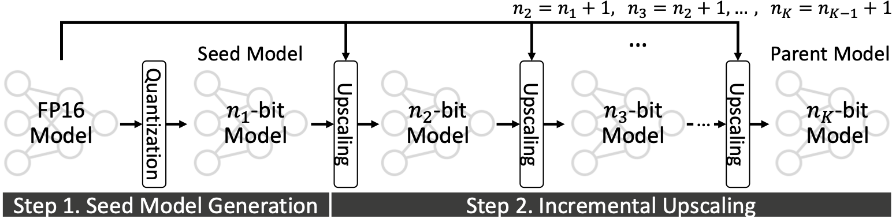
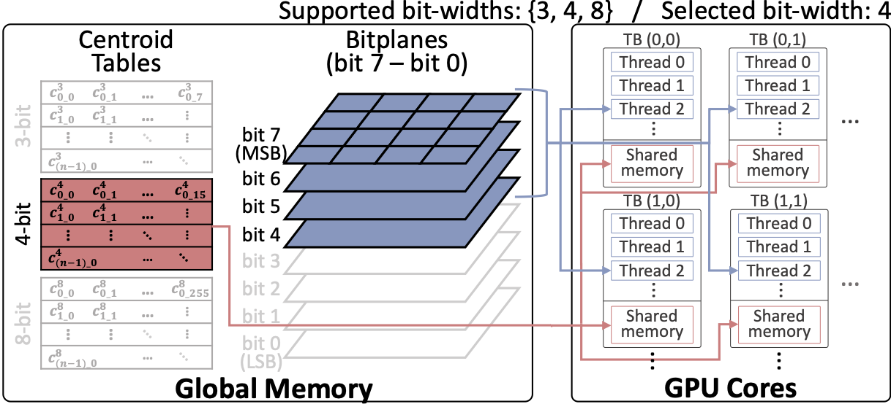

# Any-Precision LLM: Low-Cost Deployment of Multiple, Different-Sized LLMs [[Paper](http://www.arxiv.org/pdf/2402.10517)]

## Overview

Any-precion LLM is a memory-efficient and cost-effective solution for deployment of multiple, different sized LLMs.
Specifically, any-precision LLM redues the memory cost of deplying multiple, different-sized LLMs by overlaying LLMs
quantized to varying bit-widths, such as 3, 4, ..., n bits, into a memory footprint comparable to a single n-bit LLM.
This includes a lightweight any-precision quantization technique for LLMs called incremental upscaling, and a
specialized software engine for efficient serving, which is equipped with a custom CUDA kernel supporting bitplane-based
weight representation.
<div align=center>	
<p align="center">


Illustration of incremental upscaling scheme
</p>

<p align="center">

</p>

Illustration of specialized software engine for any-precision LLM
</div>

## Prerequisites

- Python 3.11
- CUDA Toolkit 12 or higher
- gcc-9 or higher

## Setup

1. Clone this repository.
2. Install the required Python packages.  
   We recommend using Python 3.11 with either Virtualenv or Conda to manage the dependencies.
    ```bash
    pip install -r requirements.txt
    ```

3. Install the Any-Precision CUDA kernels.

    ```bash
    cd any_precision_llm/modules/kernels
    pip install .
    ```
   You will need to have CUDA toolkit 12 or higher installed on your machine to build the CUDA kernels. You will also
   need gcc-9 or higher.

## Quantization

To quantize a model to any-precision, run `quantize.py` with relevant arguments:

```bash
python quantize.py <model> [options]
```

The quantization process will automatically download the model from the Hugging Face repository if it is not already
present.

The quantization process consists of the following steps:

1. Gradient calculation: The gradients of the model are calculated, for a sensitivity metric for quantization.
2. Upscaling: The model is quantized to the seed precision, and then incrementally upscaled to the parent precision.
3. Packing: The quantized model is packed into a single file, with the weights stored in bitplanes.

All steps are performed automatically.

A `cache` directory is created to store both intermediate files and the final quantized model.  
The final quantized model can be found under `cache/packed`.

**Notes**:
- We have tested the quantization on Llama, OPT and Mistral models. Other models can be automatically quantized,
but we do not guarantee the correctness of the quantization.  
- You need free space of approximately 2x the fp16 model size in RAM, VRAM, and disk to quantize the model.
For Llama 2 7B, this is approximately 28 GB.  
- The quantization process utilizes both CPU and GPU resources. As the main quantization process is CPU-bound,
use a machine with powerful multicore performance for faster quantization. However, our quantization pipeline is
highly optimized, and Llama 2 7B can be quantized in under 2 minutes on an i9-13900K machine.
On lower-end machines this will be a few times slower.

### Required Argument

- `model`: The model to quantize. Should be a Hugging Face repository, or a local path to a model.
  e.g. `meta-llama/Llama-2-7b-chat-hf`.

### Optional Arguments

- `--seed_precision`: The seed model precision. Default is 3.
- `--parent_precision`: The parent model precision. Default is 8.
  (The final quantized model will support precisions in the range `[seed_precision, parent_precision]`.)
- `--mode`: The mode of operation. Valid options are `gradients`, `quantize`, and `pack`, which are the three steps of
  quantization.
  The quantization process will abort after the specified operation. Default is `pack`, which completes the entire
  quantization process.
- `--yaml_path`: The path to the architecture config yaml file. When not specified, the model architecture is inferred
  automatically.
- `--cache_dir`: The directory to cache results in. Default is `cache`.
- `--dataset`: The dataset to use for gradient calculation. Default is `c4`.
- `--seq_len`: The sequence length to use for gradient calculation. Default is 512.
- `--num_examples`: The number of examples to use for gradient calculation. Default is 100.
- `--cpu_count`: The number of cores to use for gradient calculation. Default is the number of available cores.
- `--random_state`: The random state to use for reproducibility. When not set, the random state is not fixed. Use an
  integer.

### Flags

- `--overwrite_gradients`: Whether to overwrite the gradients stored to disk. When not set, the gradients are
  loaded from disk if available.
- `--overwrite_quantize`: Whether to overwrite the parent model stored to disk. When not set, the parent model is
  loaded from disk if available.
- `--overwrite_pack`: Whether to overwrite the packed model stored to disk. When not set, the packed model will not be
  overwritten if it already exists.

### Example Command

```bash
python quantize.py meta-llama/Llama-2-7b-chat-hf
```

## Supporting Different Models

Our quantization pipeline is designed to support any model that can be loaded from the Hugging Face repository,
by automatically detecting the linear layers for quantization. However, for better reproducibility,
we have preconfigured YAML files for the Llama, OPT, and Mistral models under the
path `any_precision_llm/analyzer/architectures`.

This is what the YAML file for the Llama model looks like:

```yaml
architecture: "LlamaForCausalLM"
arch_config:
  model_name: "model"
  layers_name: "layers"
  module_names:
    - "self_attn.q_proj"
    - "self_attn.k_proj"
    - "self_attn.v_proj"
    - "self_attn.o_proj"
    - "mlp.gate_proj"
    - "mlp.up_proj"
    - "mlp.down_proj"
```

The `architecture` field specifies what model class the YAML file is for.
Under `arch_config`, the `model_name` field specifies the name of the model attribute that contains the model.
The `layers_name` field specifies the name of the attribute that contains the layers of the model, under the model.
The `module_names` field specifies the names of the linear layers to quantize.

For models with no corresponding YAML file under `any_precision_llm/analyzer/architectures`, the quantization process
will attempt to automatically detect the linear layers to quantize. This is not guaranteed to work, and may result in
incorrect quantization.

If you wish to experiment with different model types, you can create your own YAML file under the same directory,
or specify the `yaml_path` argument to point to your custom YAML file, in which case the `architecture` field is
unnecessary.

## Inference

To use the quantized model for inference, you can use the `AnyPrecisionForCausalLM` class from the `any_precision`
module.  
Below is an example of how to load the quantized model and perform inference:

```python
from any_precision import AnyPrecisionForCausalLM
from transformers import AutoTokenizer

quanitized_model_path = "./cache/packed/anyprec-(Llama-2-7b-chat-hf)-w8_orig3-gc1-c4_s100_blk512"

model = AnyPrecisionForCausalLM.from_quantized(
    quanitized_model_path,
    trust_remote_code=True,
    fuse_layers=False,  # Will be supported in the future
    precisions=[3, 4, 5, 6, 7, 8]  # You may optionally specify a subset of supported precisions to load
)
tokenizer = AutoTokenizer.from_pretrained(quanitized_model_path)

# The following methods are supported by the quantized model, and work similarly to the original huggingface model.
# Note that you can specify the precision to use for each method.
model.forward(..., precision=3)
model.generate(..., precision=5)

# Or you can specify the precision like this:
model.set_precision(8)
```

## Demo

We have provided a demo script to showcase the dynamic inference latency of the quantized model.
To run the demo, execute the following command:

```bash
python demo.py
```

Note that the demo script requires the quantized `Llama-2-7b-chat-hf` model to be present in the cache directory.  
Other models can be used by changing the `model_path` and `original_model_path` variables in the script.

The demo script will load the quantized model, and perform inference on a custom prompt, using specified precisions. 
Include 16 to measure the latency of the original model in fp16.
The latency at each precision will be measured and displayed.

The demo will look like this when run properly:


Please note that this demo serves as a proof-of-concept. 
Further optimizations in the inference pipeline are needed to achieve the best performance of our engine.

## Evaluation

We have provided a script to evaluate the perplexity of the quantized model on various datasets.
To run the evaluation, execute the following command:

```bash
python run_eval.py
```

You can specify which datasets to evaluate on by changing the `datasets` variable within the script.  
The results are automatically appended to a JSON file. (By default, `results.json`)

## Citation

Please cite our paper if you find our work useful:

```
@inproceedings{park2024anyprecision,
      title={Any-Precision LLM: Low-Cost Deployment of Multiple, Different-Sized LLMs}, 
      author={Yeonhong Park and Jake Hyun and SangLyul Cho and Bonggeun Sim and Jae W. Lee},
      year={2024},
      booktitle={Proceedings of the 41st International Conference on Machine Learning},
}
```

